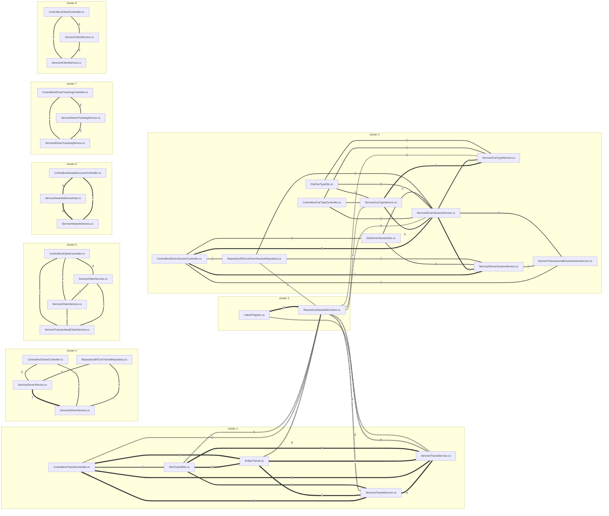

# crime scene · refaktoryzacja/cabs-java-net10 · crime-scene-skill (6bd6f91)

| field | value |
|---|---|
| commits | 96 |
| period | 2020-09-07 → 2026-09-12 |
| authors | Anna Kowalczyk, Ignacy Szreter, Kasia Wróbel, Marek Zieliński, Piotr Nowicki, Tomasz Baran |
| thresholds | top 20 · pair floor 3 shared · cluster floor J 0.30 |

## 1. Most-changed files

| commits | lines | file |
|---:|---:|---|
| 25 | 554 | `src/Cabs/Service/TransitService.cs` |
| 23 | 109 | `src/Cabs/Program.cs` |
| 21 | 212 | `src/Cabs/Repository/SqLiteDbContext.cs` |
| 19 | 201 | `src/Cabs/Entity/Transit.cs` |
| 16 | 195 | `src/Cabs/Dto/TransitDto.cs` |
| 9 | 188 | `src/Cabs/Service/DriverService.cs` |
| 9 | 23 | `src/Cabs/Service/ITransitService.cs` |
| 8 | 93 | `src/Cabs/Controllers/TransitController.cs` |
| 7 | 60 | `src/Cabs/Entity/Driver.cs` |
| 7 | 64 | `src/Cabs/Service/DriverSessionService.cs` |
| 7 | 18 | `src/Cabs/Service/IDriverService.cs` |
| 6 | 67 | `src/Cabs/Repository/EfCoreDriverSessionRepository.cs` |
| 6 | 290 | `src/Cabs/Service/AwardsServiceImpl.cs` |
| 6 | 125 | `src/Cabs/Service/CarTypeService.cs` |
| 6 | 171 | `src/Cabs/Service/ClaimService.cs` |
| 6 | 51 | `src/Cabs/Service/DriverFeeService.cs` |
| 5 | 48 | `src/Cabs/Controllers/DriverSessionController.cs` |
| 5 | 94 | `src/Cabs/Entity/CarType.cs` |
| 5 | 73 | `src/Cabs/Repository/EfCoreTransitRepository.cs` |
| 5 | 17 | `src/Cabs/Service/IAwardsService.cs` |

## 2. File pairs that change together

shared = commits with both files · J = shared / union of both histories · A, B = commits of each file.

shared says how loud the pair is, J says how tight: a busy file pairs with everything and scores a low J.

| shared | J | A | B | file A | file B |
|---:|---:|---:|---:|---|---|
| 12 | 0.52 | 16 | 19 | `src/Cabs/Dto/TransitDto.cs` | `src/Cabs/Entity/Transit.cs` |
| 12 | 0.38 | 23 | 21 | `src/Cabs/Program.cs` | `src/Cabs/Repository/SqLiteDbContext.cs` |
| 9 | 0.36 | 9 | 25 | `src/Cabs/Service/ITransitService.cs` | `src/Cabs/Service/TransitService.cs` |
| 8 | 0.89 | 8 | 9 | `src/Cabs/Controllers/TransitController.cs` | `src/Cabs/Service/ITransitService.cs` |
| 8 | 0.32 | 8 | 25 | `src/Cabs/Controllers/TransitController.cs` | `src/Cabs/Service/TransitService.cs` |
| 8 | 0.22 | 19 | 25 | `src/Cabs/Entity/Transit.cs` | `src/Cabs/Service/TransitService.cs` |
| 7 | 0.78 | 9 | 7 | `src/Cabs/Service/DriverService.cs` | `src/Cabs/Service/IDriverService.cs` |
| 7 | 0.33 | 19 | 9 | `src/Cabs/Entity/Transit.cs` | `src/Cabs/Service/ITransitService.cs` |
| 6 | 0.29 | 8 | 19 | `src/Cabs/Controllers/TransitController.cs` | `src/Cabs/Entity/Transit.cs` |
| 6 | 0.25 | 21 | 9 | `src/Cabs/Repository/SqLiteDbContext.cs` | `src/Cabs/Service/ITransitService.cs` |
| 6 | 0.18 | 19 | 21 | `src/Cabs/Entity/Transit.cs` | `src/Cabs/Repository/SqLiteDbContext.cs` |
| 6 | 0.17 | 16 | 25 | `src/Cabs/Dto/TransitDto.cs` | `src/Cabs/Service/TransitService.cs` |
| 6 | 0.15 | 21 | 25 | `src/Cabs/Repository/SqLiteDbContext.cs` | `src/Cabs/Service/TransitService.cs` |
| 5 | 1.00 | 5 | 5 | `src/Cabs/Controllers/DriverSessionController.cs` | `src/Cabs/Service/IDriverSessionService.cs` |
| 5 | 0.83 | 6 | 5 | `src/Cabs/Service/AwardsServiceImpl.cs` | `src/Cabs/Service/IAwardsService.cs` |
| 5 | 0.83 | 6 | 5 | `src/Cabs/Service/CarTypeService.cs` | `src/Cabs/Service/ICarTypeService.cs` |
| 5 | 0.71 | 5 | 7 | `src/Cabs/Controllers/DriverSessionController.cs` | `src/Cabs/Service/DriverSessionService.cs` |
| 5 | 0.71 | 7 | 5 | `src/Cabs/Service/DriverSessionService.cs` | `src/Cabs/Service/IDriverSessionService.cs` |
| 5 | 0.25 | 16 | 9 | `src/Cabs/Dto/TransitDto.cs` | `src/Cabs/Service/ITransitService.cs` |
| 5 | 0.22 | 7 | 21 | `src/Cabs/Entity/Driver.cs` | `src/Cabs/Repository/SqLiteDbContext.cs` |

## 3. Clusters — files that move as one

An edge is a pair at or over 3 shared commits and J 0.30; a cluster is what the edges connect.

The joint commits are the commits that touch two or more files of the cluster — the ones to read first.

### cluster 1 · 5 files · 16 joint commits

| commits | file |
|---:|---|
| 25 | `src/Cabs/Service/TransitService.cs` |
| 19 | `src/Cabs/Entity/Transit.cs` |
| 16 | `src/Cabs/Dto/TransitDto.cs` |
| 9 | `src/Cabs/Service/ITransitService.cs` |
| 8 | `src/Cabs/Controllers/TransitController.cs` |

**Edges**

| shared | J | file A | file B |
|---:|---:|---|---|
| 12 | 0.52 | `src/Cabs/Dto/TransitDto.cs` | `src/Cabs/Entity/Transit.cs` |
| 9 | 0.36 | `src/Cabs/Service/ITransitService.cs` | `src/Cabs/Service/TransitService.cs` |
| 8 | 0.89 | `src/Cabs/Controllers/TransitController.cs` | `src/Cabs/Service/ITransitService.cs` |
| 8 | 0.32 | `src/Cabs/Controllers/TransitController.cs` | `src/Cabs/Service/TransitService.cs` |
| 8 | 0.22 | `src/Cabs/Entity/Transit.cs` | `src/Cabs/Service/TransitService.cs` |
| 7 | 0.33 | `src/Cabs/Entity/Transit.cs` | `src/Cabs/Service/ITransitService.cs` |
| 6 | 0.29 | `src/Cabs/Controllers/TransitController.cs` | `src/Cabs/Entity/Transit.cs` |
| 6 | 0.17 | `src/Cabs/Dto/TransitDto.cs` | `src/Cabs/Service/TransitService.cs` |
| 5 | 0.25 | `src/Cabs/Dto/TransitDto.cs` | `src/Cabs/Service/ITransitService.cs` |
| 4 | 0.20 | `src/Cabs/Controllers/TransitController.cs` | `src/Cabs/Dto/TransitDto.cs` |

**Joint commits** — newest first

| commit | date | author | subject |
|---|---|---|---|
| `5b0c150` | 2023-07-19 | Anna Kowalczyk | CABS-841 Mnożnik ceny (Factor) dla przejazdów specjalnych |
| `77ed03c` | 2023-07-07 | Anna Kowalczyk | poprawka: taryfa sylwestrowa obowiązuje do 6 rano 1 stycznia |
| `3f9cda8` | 2023-06-23 | Anna Kowalczyk | CABS-830 Taryfa sylwestrowa |
| `cea3b15` | 2023-06-14 | Anna Kowalczyk | CABS-812 Taryfa Weekend+: piątek i sobota po 17 do 6 rano |
| `0ff849d` | 2023-05-31 | Anna Kowalczyk | CABS-812 Nowy cennik od 1.01.2019: taryfa weekendowa |
| `b11da9f` | 2023-03-07 | Tomasz Baran | porządki: usunięcie nieużywanych usingów |
| `90e6dcc` | 2022-11-21 | Anna Kowalczyk | CABS-490 Prowizja kierowcy zapisywana w przejeździe i widoczna w DTO |
| `0fac020` | 2021-08-05 | Anna Kowalczyk | CABS-275 Estymata ceny przy zamówieniu przejazdu |
| `489d7fd` | 2021-03-12 | Piotr Nowicki | Klasa auta w zamówieniu i sesji kierowcy; dobór kierowców po klasie |
| `bd1bb75` | 2020-12-01 | Anna Kowalczyk | Zmiana adresu odbioru: najwyżej 3 zmiany i 250 m od pierwotnego |
| `556ea5d` | 2020-11-18 | Marek Zieliński | Zmiana adresu docelowego w trakcie przejazdu |
| `ce39e10` | 2020-11-04 | Marek Zieliński | Start i zakończenie przejazdu z wyliczeniem ceny końcowej |
| `d585e29` | 2020-10-28 | Marek Zieliński | Akceptacja i odrzucenie przejazdu przez kierowcę |
| `88cf8b7` | 2020-10-14 | Marek Zieliński | Publikacja przejazdu i dobór kierowców w promieniu od adresu odbioru |
| `447b0c8` | 2020-09-14 | Marek Zieliński | Anulowanie przejazdu |
| `6d11473` | 2020-09-07 | Marek Zieliński | Inicjalny import: zamówienie przejazdu, klienci, kierowcy |

### cluster 2 · 10 files · 8 joint commits

| commits | file |
|---:|---|
| 7 | `src/Cabs/Service/DriverSessionService.cs` |
| 6 | `src/Cabs/Repository/EfCoreDriverSessionRepository.cs` |
| 6 | `src/Cabs/Service/CarTypeService.cs` |
| 5 | `src/Cabs/Controllers/DriverSessionController.cs` |
| 5 | `src/Cabs/Service/ICarTypeService.cs` |
| 5 | `src/Cabs/Service/IDriverSessionService.cs` |
| 4 | `src/Cabs/Service/TransactionalDriverSessionService.cs` |
| 3 | `src/Cabs/Controllers/CarTypeController.cs` |
| 3 | `src/Cabs/Dto/CarTypeDto.cs` |
| 3 | `src/Cabs/Dto/DriverSessionDto.cs` |

**Edges**

| shared | J | file A | file B |
|---:|---:|---|---|
| 5 | 1.00 | `src/Cabs/Controllers/DriverSessionController.cs` | `src/Cabs/Service/IDriverSessionService.cs` |
| 5 | 0.83 | `src/Cabs/Service/CarTypeService.cs` | `src/Cabs/Service/ICarTypeService.cs` |
| 5 | 0.71 | `src/Cabs/Controllers/DriverSessionController.cs` | `src/Cabs/Service/DriverSessionService.cs` |
| 5 | 0.71 | `src/Cabs/Service/DriverSessionService.cs` | `src/Cabs/Service/IDriverSessionService.cs` |
| 4 | 0.50 | `src/Cabs/Service/DriverSessionService.cs` | `src/Cabs/Service/ICarTypeService.cs` |
| 4 | 0.44 | `src/Cabs/Service/CarTypeService.cs` | `src/Cabs/Service/DriverSessionService.cs` |
| 3 | 0.60 | `src/Cabs/Controllers/CarTypeController.cs` | `src/Cabs/Service/ICarTypeService.cs` |
| 3 | 0.60 | `src/Cabs/Controllers/DriverSessionController.cs` | `src/Cabs/Dto/DriverSessionDto.cs` |
| 3 | 0.60 | `src/Cabs/Dto/CarTypeDto.cs` | `src/Cabs/Service/ICarTypeService.cs` |
| 3 | 0.60 | `src/Cabs/Dto/DriverSessionDto.cs` | `src/Cabs/Service/IDriverSessionService.cs` |
| 3 | 0.50 | `src/Cabs/Controllers/CarTypeController.cs` | `src/Cabs/Service/CarTypeService.cs` |
| 3 | 0.50 | `src/Cabs/Controllers/DriverSessionController.cs` | `src/Cabs/Service/TransactionalDriverSessionService.cs` |
| 3 | 0.50 | `src/Cabs/Dto/CarTypeDto.cs` | `src/Cabs/Service/CarTypeService.cs` |
| 3 | 0.50 | `src/Cabs/Service/IDriverSessionService.cs` | `src/Cabs/Service/TransactionalDriverSessionService.cs` |
| 3 | 0.43 | `src/Cabs/Controllers/CarTypeController.cs` | `src/Cabs/Service/DriverSessionService.cs` |
| 3 | 0.43 | `src/Cabs/Dto/CarTypeDto.cs` | `src/Cabs/Service/DriverSessionService.cs` |
| 3 | 0.43 | `src/Cabs/Dto/DriverSessionDto.cs` | `src/Cabs/Service/DriverSessionService.cs` |
| 3 | 0.38 | `src/Cabs/Controllers/DriverSessionController.cs` | `src/Cabs/Repository/EfCoreDriverSessionRepository.cs` |
| 3 | 0.38 | `src/Cabs/Repository/EfCoreDriverSessionRepository.cs` | `src/Cabs/Service/IDriverSessionService.cs` |
| 3 | 0.38 | `src/Cabs/Service/DriverSessionService.cs` | `src/Cabs/Service/TransactionalDriverSessionService.cs` |
| 3 | 0.30 | `src/Cabs/Repository/EfCoreDriverSessionRepository.cs` | `src/Cabs/Service/DriverSessionService.cs` |

**Joint commits** — newest first

| commit | date | author | subject |
|---|---|---|---|
| `8c18f22` | 2025-02-24 | Piotr Nowicki | CABS-1030 Marka auta w sesji kierowcy |
| `52477f0` | 2023-11-23 | Piotr Nowicki | wylogowanie bieżącej sesji kierowcy |
| `b11da9f` | 2023-03-07 | Tomasz Baran | porządki: usunięcie nieużywanych usingów |
| `56bfafa` | 2021-05-06 | Piotr Nowicki | Licznik aktywnych aut w klasie |
| `7b95f1b` | 2021-04-21 | Piotr Nowicki | usuwanie klasy auta |
| `a813db0` | 2021-04-07 | Piotr Nowicki | CABS-118 Minimalna liczba aut w klasie do aktywacji |
| `489d7fd` | 2021-03-12 | Piotr Nowicki | Klasa auta w zamówieniu i sesji kierowcy; dobór kierowców po klasie |
| `5232742` | 2020-09-24 | Piotr Nowicki | Sesje kierowców: logowanie i wylogowanie ze zmiany |

### cluster 3 · 2 files · 12 joint commits

| commits | file |
|---:|---|
| 23 | `src/Cabs/Program.cs` |
| 21 | `src/Cabs/Repository/SqLiteDbContext.cs` |

**Edges**

| shared | J | file A | file B |
|---:|---:|---|---|
| 12 | 0.38 | `src/Cabs/Program.cs` | `src/Cabs/Repository/SqLiteDbContext.cs` |

**Joint commits** — newest first

| commit | date | author | subject |
|---|---|---|---|
| `0d69608` | 2022-11-14 | Tomasz Baran | CABS-480 Umowy z klientami firmowymi: encje i repozytoria |
| `2502287` | 2022-07-15 | Anna Kowalczyk | CABS-410 Reklamacje: encja, repozytorium, numeracja |
| `dc9a69e` | 2022-02-04 | Tomasz Baran | Program lojalnościowy: konto i mile (encje, repozytoria) |
| `36d5df8` | 2021-12-31 | Piotr Nowicki | Atrybuty kierowcy: encja i repozytorium |
| `135ae3f` | 2021-08-12 | Anna Kowalczyk | CABS-210 Prowizja kierowcy: encja i repozytorium |
| `bf04393` | 2021-06-02 | Anna Kowalczyk | Faktura: encja i repozytorium |
| `a813db0` | 2021-04-07 | Piotr Nowicki | CABS-118 Minimalna liczba aut w klasie do aktywacji |
| `489d7fd` | 2021-03-12 | Piotr Nowicki | Klasa auta w zamówieniu i sesji kierowcy; dobór kierowców po klasie |
| `900885c` | 2021-03-09 | Piotr Nowicki | Klasy samochodów: encja, repozytorium, mapowanie |
| `58be1aa` | 2020-09-28 | Piotr Nowicki | Pozycje kierowców: encja i repozytorium |
| `af205a0` | 2020-09-22 | Piotr Nowicki | Sesje kierowców: encja i repozytorium |
| `6d11473` | 2020-09-07 | Marek Zieliński | Inicjalny import: zamówienie przejazdu, klienci, kierowcy |

### cluster 4 · 4 files · 7 joint commits

| commits | file |
|---:|---|
| 9 | `src/Cabs/Service/DriverService.cs` |
| 7 | `src/Cabs/Service/IDriverService.cs` |
| 5 | `src/Cabs/Repository/EfCoreTransitRepository.cs` |
| 3 | `src/Cabs/Controllers/DriverController.cs` |

**Edges**

| shared | J | file A | file B |
|---:|---:|---|---|
| 7 | 0.78 | `src/Cabs/Service/DriverService.cs` | `src/Cabs/Service/IDriverService.cs` |
| 3 | 0.43 | `src/Cabs/Controllers/DriverController.cs` | `src/Cabs/Service/IDriverService.cs` |
| 3 | 0.33 | `src/Cabs/Controllers/DriverController.cs` | `src/Cabs/Service/DriverService.cs` |
| 3 | 0.33 | `src/Cabs/Repository/EfCoreTransitRepository.cs` | `src/Cabs/Service/IDriverService.cs` |
| 3 | 0.27 | `src/Cabs/Repository/EfCoreTransitRepository.cs` | `src/Cabs/Service/DriverService.cs` |

**Joint commits** — newest first

| commit | date | author | subject |
|---|---|---|---|
| `b11da9f` | 2023-03-07 | Tomasz Baran | porządki: usunięcie nieużywanych usingów |
| `43c5c22` | 2021-12-31 | Piotr Nowicki | Dodawanie atrybutu kierowcy (punkty karne, badania, narodowość) |
| `63fc410` | 2021-11-12 | Piotr Nowicki | Rozliczenie roczne kierowcy |
| `d5b6264` | 2021-11-05 | Piotr Nowicki | CABS-260 Rozliczenie miesięczne kierowcy z prowizji |
| `d03687d` | 2021-07-23 | Piotr Nowicki | Zdjęcie kierowcy w base64 |
| `6a7ff7d` | 2021-07-08 | Piotr Nowicki | Walidacja numeru prawa jazdy przy aktywacji kierowcy |
| `6d11473` | 2020-09-07 | Marek Zieliński | Inicjalny import: zamówienie przejazdu, klienci, kierowcy |

### cluster 5 · 4 files · 3 joint commits

| commits | file |
|---:|---|
| 6 | `src/Cabs/Service/ClaimService.cs` |
| 3 | `src/Cabs/Controllers/ClaimController.cs` |
| 3 | `src/Cabs/Service/IClaimService.cs` |
| 3 | `src/Cabs/Service/TransactionalClaimService.cs` |

**Edges**

| shared | J | file A | file B |
|---:|---:|---|---|
| 3 | 1.00 | `src/Cabs/Controllers/ClaimController.cs` | `src/Cabs/Service/IClaimService.cs` |
| 3 | 1.00 | `src/Cabs/Controllers/ClaimController.cs` | `src/Cabs/Service/TransactionalClaimService.cs` |
| 3 | 1.00 | `src/Cabs/Service/IClaimService.cs` | `src/Cabs/Service/TransactionalClaimService.cs` |
| 3 | 0.50 | `src/Cabs/Controllers/ClaimController.cs` | `src/Cabs/Service/ClaimService.cs` |
| 3 | 0.50 | `src/Cabs/Service/ClaimService.cs` | `src/Cabs/Service/IClaimService.cs` |
| 3 | 0.50 | `src/Cabs/Service/ClaimService.cs` | `src/Cabs/Service/TransactionalClaimService.cs` |

**Joint commits** — newest first

| commit | date | author | subject |
|---|---|---|---|
| `b11da9f` | 2023-03-07 | Tomasz Baran | porządki: usunięcie nieużywanych usingów |
| `5a81c33` | 2022-08-26 | Anna Kowalczyk | CABS-430 Automatyczne rozpatrywanie reklamacji: zwrot do 3 reklamacji, reszta eskalacja |
| `b6bd4c3` | 2022-07-18 | Anna Kowalczyk | CABS-410 Zgłoszenie reklamacji i zmiana statusu |

### cluster 6 · 3 files · 5 joint commits

| commits | file |
|---:|---|
| 6 | `src/Cabs/Service/AwardsServiceImpl.cs` |
| 5 | `src/Cabs/Service/IAwardsService.cs` |
| 4 | `src/Cabs/Controllers/AwardsAccountController.cs` |

**Edges**

| shared | J | file A | file B |
|---:|---:|---|---|
| 5 | 0.83 | `src/Cabs/Service/AwardsServiceImpl.cs` | `src/Cabs/Service/IAwardsService.cs` |
| 4 | 0.80 | `src/Cabs/Controllers/AwardsAccountController.cs` | `src/Cabs/Service/IAwardsService.cs` |
| 4 | 0.67 | `src/Cabs/Controllers/AwardsAccountController.cs` | `src/Cabs/Service/AwardsServiceImpl.cs` |

**Joint commits** — newest first

| commit | date | author | subject |
|---|---|---|---|
| `b11da9f` | 2023-03-07 | Tomasz Baran | porządki: usunięcie nieużywanych usingów |
| `06395c2` | 2022-03-04 | Tomasz Baran | Transfer mil między klientami |
| `f822160` | 2022-02-18 | Tomasz Baran | Mile specjalne i zdejmowanie mil z konta |
| `bc4252a` | 2022-02-11 | Tomasz Baran | aktywacja i dezaktywacja konta lojalnościowego |
| `66680c3` | 2022-02-04 | Tomasz Baran | Program lojalnościowy: rejestracja klienta i mile za przejazd |

### cluster 7 · 3 files · 3 joint commits

| commits | file |
|---:|---|
| 4 | `src/Cabs/Service/DriverTrackingService.cs` |
| 3 | `src/Cabs/Controllers/DriverTrackingController.cs` |
| 3 | `src/Cabs/Service/IDriverTrackingService.cs` |

**Edges**

| shared | J | file A | file B |
|---:|---:|---|---|
| 3 | 1.00 | `src/Cabs/Controllers/DriverTrackingController.cs` | `src/Cabs/Service/IDriverTrackingService.cs` |
| 3 | 0.75 | `src/Cabs/Controllers/DriverTrackingController.cs` | `src/Cabs/Service/DriverTrackingService.cs` |
| 3 | 0.75 | `src/Cabs/Service/DriverTrackingService.cs` | `src/Cabs/Service/IDriverTrackingService.cs` |

**Joint commits** — newest first

| commit | date | author | subject |
|---|---|---|---|
| `b11da9f` | 2023-03-07 | Tomasz Baran | porządki: usunięcie nieużywanych usingów |
| `0fdbac5` | 2020-10-01 | Piotr Nowicki | Dystans przejechany przez kierowcę w przedziale czasu |
| `040b3be` | 2020-09-28 | Piotr Nowicki | Rejestracja pozycji GPS kierowcy |

### cluster 8 · 3 files · 3 joint commits

| commits | file |
|---:|---|
| 3 | `src/Cabs/Controllers/ClientController.cs` |
| 3 | `src/Cabs/Service/ClientService.cs` |
| 3 | `src/Cabs/Service/IClientService.cs` |

**Edges**

| shared | J | file A | file B |
|---:|---:|---|---|
| 3 | 1.00 | `src/Cabs/Controllers/ClientController.cs` | `src/Cabs/Service/ClientService.cs` |
| 3 | 1.00 | `src/Cabs/Controllers/ClientController.cs` | `src/Cabs/Service/IClientService.cs` |
| 3 | 1.00 | `src/Cabs/Service/ClientService.cs` | `src/Cabs/Service/IClientService.cs` |

**Joint commits** — newest first

| commit | date | author | subject |
|---|---|---|---|
| `b11da9f` | 2023-03-07 | Tomasz Baran | porządki: usunięcie nieużywanych usingów |
| `f4e3ab1` | 2022-05-13 | Anna Kowalczyk | CABS-330 Typ klienta VIP, rodzaj klienta i domyślny sposób płatności |
| `6d11473` | 2020-09-07 | Marek Zieliński | Inicjalny import: zamówienie przejazdu, klienci, kierowcy |

## 4. Graph (Mermaid)

One subgraph per cluster, one node per file, edge label = shared commits; a dotted edge crosses clusters (from 4 shared).

## 5. Diagnosis

| cluster | symptom | confidence | joint commits |
|---|---|---|---|
| 1 | silent drift — two copies of one rule | high | 16 |
| 3 | registration coupling — not a finding | high | 12 |

> **Silent drift — two copies of one rule** · cluster 1 · confidence: high
> **Evidence:** `Transit.CalculateCost` and `TransitDto.SetTariff` set the km rate of one tariff in
> one commit four times — `0ff849d`, `cea3b15`, `3f9cda8`, `77ed03c` — and every message names the
> price list: "Nowy cennik od 1.01.2019: taryfa weekendowa", "Taryfa Weekend+: piątek i sobota po 17
> do 6 rano", "Taryfa sylwestrowa", "taryfa sylwestrowa obowiązuje do 6 rano 1 stycznia".
> **What it means:** the tariff rule is implemented twice — the entity computes the price, the DTO
> computes the rate and the tariff name the client reads — so the two copies can disagree and nothing
> has to fail for that to happen.
> **Move:** change one copy by hand — set the Sylwester rate in `TransitDto.SetTariff` to `4.50f` —
> and run `dotnet test src/CabsTests`. Green means nothing guards the rate the client reads.
> **What would disprove it:** the suite goes red on the one-sided change. Or the paired edits are
> unrelated: one changes the price, the other only renames a label.

> **Registration coupling — not a finding** · cluster 3 · confidence: high
> **Evidence:** `Program.cs` and `SqLiteDbContext.cs` change in one commit 12 times — `af205a0`,
> `900885c`, `135ae3f`, `dc9a69e`, `2502287`, `0d69608` — and the messages say "encja i repozytorium"
> or "encje i repozytoria" each time. `Program.cs` adds one `builder.Services.AddTransient<...>` line,
> `SqLiteDbContext.cs` adds one `DbSet` and one `modelBuilder.Entity<...>` mapping block.
> **What it means:** the framework demands the registration — a new entity needs a mapping and its
> repository needs a DI line; the design is fine.
> **Move:** none.
> **What would disprove it:** `Program.cs` or `SqLiteDbContext.cs` carries a business rule of its own
> — a rate, a threshold, a branch on a domain value. Then it is a finding.

I read the joint commits of all 8 clusters. Clusters 2, 4, 5, 6, 7 and 8 match no row of the
catalogue, and their numbers already stand in sections 1 to 3.

## How to reproduce

/crime-scene <repo path>

Sections 1 to 4 are deterministic: the same repository always gives these bytes.
Section 5 is a reading of the commits, and every row names the observation that would kill it.
